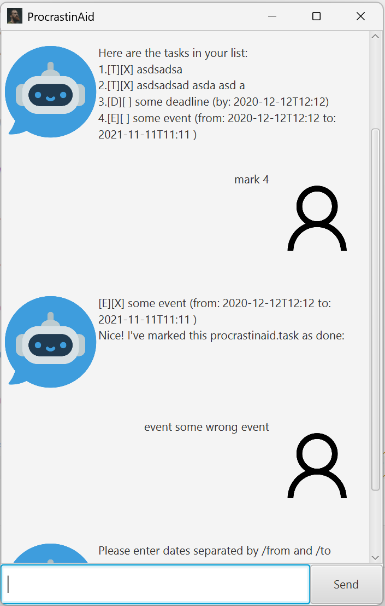

# ProcrastinAid User Guide

The ProcrastinAid application is a task management tool designed to help users organize and prioritize their tasks 
efficiently. With ProcrastinAid, users can add, delete, and mark tasks as done, set deadlines, and categorize tasks 
with tags. The application features a user-friendly JavaFX GUI, making it easy to interact with and manage tasks 
visually. ProcrastinAid aims to boost productivity by providing a clear overview of tasks and deadlines, ensuring 
that users stay on top of their responsibilities.

## Adding Tasks, Deadlines and Events

You can add deadlines to tasks by specifying a date and time. ProcrastinAid will display the deadline in the task list,
allowing you to keep track of upcoming deadlines easily.

Example: `deadline Finish report /by 2021-09-30 23:59`

Example: `event Meeting with team /from 2021-09-30 14:00 /to 2021-09-30 16:00`

Example: `todo Buy groceries`

## Feature List all tasks

You can view all tasks in the task list by entering the `list` command. ProcrastinAid will display all tasks, 
including their type, description, and status.

## Feature Mark and Unmark tasks as done

You can mark tasks as done by entering the `mark` command followed by the task number. ProcrastinAid will update the 
task status to done, making it easy to track completed tasks.
